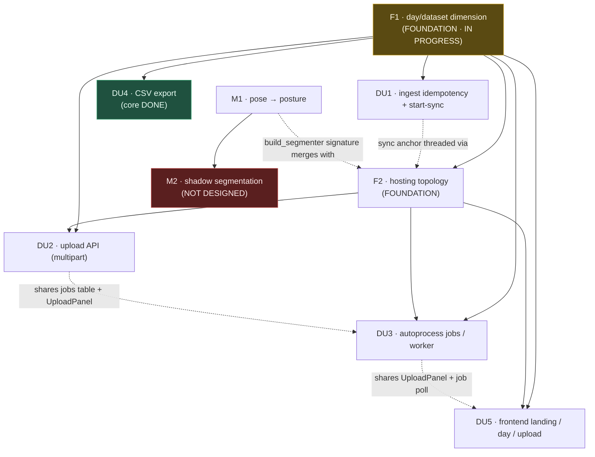

I have everything needed: all 8 workstream designs are present (F1, F2, DU1, DU2, DU3, DU4, DU5, M1). The review agents, synthesis, and M2-shadow-seg all failed (lines 12, 14, 16, 17, 21, 22, 23, 24 are `started` with no `result`) — so there are no review objects in the journal; I'll fold in each design's self-identified risks and the cross-workstream reconciliations instead. Here is the roadmap.

# Cownting Roadmap — Multi-Day Uploads, Split Hosting, and the Model Track

> Synthesized from the wf_8d39419d design journal. **Note on reviews:** the review, synthesis, and M2-shadow-seg agents failed and produced no output, so there are no verdict/issues objects to fold in. In their place, each workstream summary below folds in that design's own stated risks plus the cross-workstream reconciliations the designs surfaced in one another (these function as the "missed dependencies" a review would have flagged). M2 (shadow segmentation) has **no design yet** and is carried as an explicit gap.

## 1. Architecture Summary

Cownting moves from a single-box, single-day, whole-DB dashboard to a **multi-day app on a split GPU-box / small-serve-box topology**, built on two foundations. **The day/dataset dimension (F1)** turns the flat DuckDB into a star schema: a `datasets` dimension keyed by a `dataset_id` day-slug, joined by a `dataset_id` foreign key on both `frames` and `detections`, so every fact's identity becomes `(dataset_id, camera_id, frame_idx)`, frame artifacts move under a per-dataset subdir, every query helper gains an optional `dataset_id` filter (None = today's whole-DB behavior, keeping the hermetic test green), and re-ingest becomes idempotent via delete-then-insert. **The hosting split (F2)** respects DuckDB's single-writer-per-file lock by keeping exactly **one** master DuckDB on the serve box whose sole writer is an in-process merge thread; the GPU box runs only ingest+segment against throwaway per-job scratch DBs, ships an immutable parquet+JPG bundle over an rsync spool (`inbox`/`outbox` + `jobs` table), and the serve box imports the bundle and runs the model-free `localize` (point-in-polygon against the operator's live count-area/panel JSON). On top of these, the upload API (DU2), auto-processing job engine (DU3), frontend landing/day/upload surface (DU5), CSV export (DU4), cross-camera sync + idempotency (DU1), and the pose-posture model swap (M1) all compose without rewriting existing db.py queries — because the serve box stays model-free and every new column is additive.

## 2. Dependency Graph

Critical path: **F1 → F2 → {DU2, DU3, DU5}**. `DU1` and `DU4` hang off F1 only (parallel to F2). `M1`/`M2` are an independent model track with no dependency on the hosting work.

## 3. Phased Sequencing

| Phase | Goal | Workstreams | Effort | On critical path? |
|---|---|---|---|---|
| **0 — Foundation (in flight)** | Finish the day/dataset dimension end-to-end; the CSV seam. | **F1** (finish: `cli migrate` + API `?dataset` threading + frontend DatasetPicker — *schema/helpers, `resolve_dataset`, ingest/pipeline threading already DONE*); **DU4** core (`db.export_df` + `GET /api/export.csv` **DONE**) | F1 remainder **S–M** · DU4 **S** | **Yes (F1)** |
| **1 — Multi-day correctness** | Make re-ingest idempotent and make `frame_idx` a true cross-camera timeline. | **DU1** (needs F1 only; pure sync functions + per-camera purge-then-insert) | **M** | No (parallel to F2) |
| **2 — Hosting topology** | Split GPU/serve; single serve-owned writer + merge thread; spool + `jobs` table; bundle export/import. | **F2** | **L (XL-leaning)** | **Yes** |
| **3 — Upload + autoprocess** | Land videos as a dataset; run ingest→segment→localize with progress/resume/retry, zero manual CLI. | **DU2** (upload contract), **DU3** (worker daemons + job state machine) | DU2 **M** · DU3 **L** | **Yes** |
| **4 — Multi-day frontend** | Landing page, `/day/:datasetId` deep links, multi-camera upload form, live job polling. | **DU5** | **L** | **Yes** (UI scaffolding can start once F1 picker + F2 job contract exist) |
| **5 — Model track (independent)** | Real per-instance pose → standing/lying (retire elongation as primary). Then shadow seg. | **M1** (pose), then **M2** (shadow — *needs design first*) | M1 **L** · M2 **L+ (unscoped)** | No |

Sequencing notes: Phase 1 can run fully in parallel with Phase 2 (both need only F1). Phase 4 UI work overlaps Phase 3 as soon as the F2 job contract and F1 frontend picker are stable. The **model track (Phase 5) is schedulable anytime** a CUDA box and animal-pose weights exist; it touches only the detect layer and the GPU-side segment stage, so it never blocks the hosting critical path.

## 4. Workstream Summaries (with folded-in fixes)

**F1 · day/dataset dimension — IN PROGRESS · L.** Star schema: a `datasets` dimension (`dataset_id` PK day-slug, `day`, `label`, `status`) plus a `dataset_id` FK on `frames`/`detections`; canonical frame identity becomes `(dataset_id, camera_id, frame_idx)` and artifacts move to `<artifacts_dir>/<dataset_id>/frames/<cam>/`. Every helper gains a trailing `dataset_id=None` (None → no WHERE clause → byte-identical SQL → hermetic test stays green); the API resolves `requested or latest_dataset()` with a whole-DB fallback only when the dim is empty. Idempotency via `purge_dataset`. **Folded fixes:** the `index_video` path change embedding `dataset_id` is **load-bearing and must land with the schema change**, or new-day frames overwrite day-0 on disk; the `dataset_id=None → no WHERE` and `latest_dataset()→None-on-empty` behaviors are the *only* thing keeping the test green (never apply an unconditional "latest" default); migration edits the live DB in place, so snapshot to `.bak` (exists) first. **Remaining per lead:** `cli migrate`, API `?dataset` threading, frontend picker.

**F2 · hosting topology — L(→XL).** Chooses **Option B**: one serve-owned read-write DuckDB, a background merge thread as the *sole* writer, API reads via `con.cursor()` (DuckDB MVCC serializes). GPU box runs a `cownting worker` daemon → ingest+segment on a per-job scratch Config → `COPY … TO parquet` + JPG bundle → rsync `outbox` with a `.ready` sentinel synced **last**. Serve box imports the bundle (rewriting `frame_path`/`overlay_path` to its own artifacts dir), then runs `localize` on the shared writer. **Folded fixes:** the path-rewrite step is the single most bug-prone point (miss it → every image 404s); results must be gated on the `.ready` sentinel or a `.partial`→final rename to avoid reading half-transferred bundles; uploaded-file mtime = upload time, so an explicit per-camera `start` is mandatory or every chart lands on the wrong day; the merge thread must start **only when `paths.spool` is set** so the TestClient/hermetic gate is unaffected; `POST /api/uploads` has no auth by default. **Reconciliation:** F2 should fold DU3's `stage/progress/attempts` columns into its `jobs` CREATE if they land together (else DU3 keeps the ALTERs); `import_bundle`'s delete-by-`dataset_id` + insert must be one transaction.

**DU1 · ingest idempotency + start-sync — M.** Two fixes: (1) idempotency via per-camera **delete-then-insert** (`purge_dataset(dataset_id, camera_id)` + `rmtree` the leaf dir) *inside* the camera loop, wrapped per-camera in a transaction — no UNIQUE/PK (legacy `world_x/y` dupes would fail the constraint); (2) cross-camera sync: `t0 = max(camera starts)`, cadence = `frame_interval_seconds or 1/target_fps`, `frame_idx = round((ts−t0)/cadence)`, dropping `<0` lead frames, so `frame_idx=k` is the same wall-clock instant across cameras and db.py's `GROUP BY frame_idx` aggregations become correct with zero query changes. `sync_t0`/`cadence_seconds` are stored on the F1 `datasets` row. For same-start day-0 data this reproduces `0..479` exactly (no re-index, no file moves). **Folded fixes / critical reconciliation with F1:** DU1's **per-camera-in-loop purge supersedes F1's whole-dataset-before-loop purge** — if F1's version runs with only a subset of cameras listed, it silently deletes the omitted cameras; the two designs must agree on per-camera granularity. **Reconciliation with F2:** a per-camera re-upload on the serve box must re-index against the master's stored `sync_t0` (carried in the F2 manifest), not a fresh GPU-scratch value, or the replaced camera drifts off-axis.

**DU2 · upload API — M.** `POST /api/uploads` (multipart): repeated `videos` parts + one `manifest` JSON field validated as `UploadManifest{cameras:[{name, filename, start (ISO, required), frame_interval_seconds?}], ingest?, dataset?}`. Validation + streaming file-landing live in a testable `cownting/uploads.py`, not inline in the route. Streams each video with `shutil.copyfileobj` into `inbox/<job_id>.partial/`, `os.replace`s to the final dir **before** inserting the `jobs` row, returns **202** `{job_id, dataset_id, status:'queued'}` — non-blocking. **Folded fixes:** the editable camera `name` becomes `camera_id` used verbatim as a filesystem subdir and as the `region_id` prefix `{camera_id}::{area_id}`, so the strict slug `^[A-Za-z0-9][A-Za-z0-9_-]{0,63}$` check is load-bearing (a `/`, `..`, `:`, or space corrupts paths, joins, and region parsing); `start` is required at upload though optional in `CameraCfg` (the single most important business check); never `await file.read()` a multi-GB video (stream it); `python-multipart` must be installed in **both** the serve venv and the pre-boot gate venv or `serve` refuses to boot. **Reconciliation:** consumes F2's spool/`jobs`/`insert_job` and F1's `dataset_id` — does not reimplement them; `UploadPanel.tsx` is co-owned with F2/DU5 (single owner needed).

**DU3 · autoprocess jobs — L.** Turns the existing single-box `process()` into `process_dataset(config, dataset_id, stages, con, on_progress, limit)` — one dataset-scoped orchestrator that runs any contiguous subset of ingest/segment/localize, reports per-stage progress, and is crash-resumable via `datasets.status` + segment's NOT-processed-frame grain. Fills F2's `worker.py`/`spool.py` with the real GPU daemon (`ingest`+`segment`) and serve-box merge loop (`import`+`localize`), a `cownting/jobs.py` state machine (`queued→processing→merging→ready|failed`), `stage/progress/attempts` columns for a real progress bar, and `POST /api/jobs/{id}/retry`. **Folded fixes:** `import_bundle` must be one BEGIN/COMMIT/ROLLBACK (else a crash leaves frames-deleted-but-detections-missing); `jobs.status` (lifecycle) vs `datasets.status` (data maturity) must not be conflated — `jobs.py` exists to keep them separate; **heavy imports (`build_segmenter`/torch) must stay lazy** so the model-free serve box and the test gate never pull GPU deps; retry must distinguish GPU-side failure (requeue `*.failed`→inbox) from merge-side failure (reset row to `merging`); both daemon loops must catch per-job exceptions so one bad job can't halt auto-processing. **Reconciliation:** localize runs on the serve box post-merge (needs the operator's live `count_areas.json`); a manual single-box `cownting process` on the GPU box is dev-only.

**DU4 · CSV export — CORE DONE · S.** `db.export_df` + `GET /api/export.csv` are **implemented**. Remaining polish (optional, additive): thread F1's `dataset_id`/`day`/`label` into the denormalized detection-grain view with an optional `?dataset=<id>` scope (omit = whole-DB, all days — a deliberate export-specific default distinct from F1's "latest" rule); replace the RAM-materializing `Response(df.to_csv())` with DuckDB `COPY … TO <tempfile>` + `FileResponse` streaming (bounded RAM on the small box as days accumulate); and render the currently-dead `exportCsvUrl()` via a new `ExportButton` in the KpiPanel footer wired to `useDataset()` ("This day" / "All days"). **Folded fixes:** `COPY` path must come from `tempfile.mkstemp` and `dataset_id` must be a bound param (no interpolation); close the connection before the streamed response returns; the export join must use F1's `(dataset_id, camera_id, frame_path)` key, so this refinement lands **after** F1.

**DU5 · frontend landing/day/upload — L.** Routes: `/`→Home (data-package gallery + Upload CTA + in-flight jobs), `/upload`→multi-camera form, `/day/:datasetId`→Dashboard (deep-linkable), `/count-area/:camera` unchanged. The load-bearing mechanism: a URL-derived `DatasetProvider` (active `dataset_id` comes from `matchPath('/day/:datasetId')`, else latest, else null) that (a) sets a module-level api.ts var **synchronously during render** so every `j<T>` fetch auto-appends `&dataset`, and (b) keys `<Dashboard key={datasetId}/>` so a day-switch remounts the whole subtree and every child re-fetches with **zero per-view edits**. `UploadPanel` builds the FormData and polls `getJob` until ready/failed. **Folded fixes:** `setActiveDatasetParam` must be called during render, not in an effect, or child mount-fetches race the old dataset; `TimelineProvider` (above the keyed subtree) is the one component needing an explicit `[datasetId]` dep (set `frame=null`, refetch, reset to mid-day); require the per-camera `start` client-side (disable Submit until present); the one backend touch DU5 owns is adding `?dataset` to `GET /api/img/reference/{camera}`. **Reconciliation:** all new components deliberately use the shipped soft-cornered `rounded-2xl`/`rounded-full` UI, a documented departure from the "no border-radius" brief.

**M1 · pose → posture — L (independent).** New `cownting/detect/pose.py` with a `PoseEstimator` protocol + a canonical ~8-joint vocabulary; masked per-instance crops are batch-inferred in the segment stage and `posture_from_keypoints` (scale-invariant `h_ratio = (hoof_y−back_y)/body_length`) supersedes `posture_from_mask`. Because `posture` is already free-text VARCHAR and every consumer uses string equality, the binary `standing/lying` swap needs **zero** schema/API/frontend change; `grazing` is an opt-in extended vocabulary; `lame` is deferred (needs temporal gait + tracking). Gated by the existing `flags.pose_enabled`; runs only on the GPU box, so the bundle carries the same `posture` string and serve stays model-free. **Folded fixes:** YOLO11-pose ships **human** COCO keypoints and produces garbage on cows — real animal-pose weights (fine-tuned YOLO11-pose or zero-shot SuperAnimal-Quadruped) are required; keep `pose_enabled=false` until they exist; keep elongation as a **confidence-gated fallback** (don't hard-remove) so occluded/distant cows on this oblique fisheye footage don't regress the dashboard to `unknown`; mask-background zeroing must stay on so a loose bbox can't latch onto a neighbor. **Reconciliation:** the `build_segmenter(detect, posture, flags, pose)` signature change must merge with F2/DU3's `process_upload` segment path.

**M2 · shadow segmentation — NOT DESIGNED (gap).** The design agent failed. Scope from `futurework.md`: add a panel/shadow class to the seg model (or a dedicated model) to auto-extract panel footprints and, ultimately, a sun-dependent moving shade map filling the reserved `in_shade` flag (distinct from footprint `under_panel`). Stays image-space and calibration-free. **Action: needs its own design pass before it can be scheduled** — carry as a Phase-5 follow-on to M1.

## 5. Consolidated Open Decisions (deduped) + Recommendations

| # | Decision (sources) | Recommendation |
|---|---|---|
| 1 | **`dataset_id` format** — day-slug `2025-06-28` vs opaque ULID (F1) | **Day-slug** (same-day re-ingest replaces; a same-day re-shoot passes an explicit label/suffix). |
| 2 | **Dataset grain** — whole-day across all cameras vs single-camera package (F1, DU1, DU2) | **Day-grain spanning cameras**; single-camera add/replace = `purge_dataset(dataset_id, camera_id)` + re-ingest into the same id. |
| 3 | **Purge granularity** — F1 whole-dataset-before-loop vs DU1 per-camera-in-loop (F1↔DU1, **critical**) | **Per-camera-in-loop** (DU1 supersedes F1). Prevents silently deleting omitted cameras on a subset re-ingest. |
| 4 | **API default when `?dataset` omitted** (F1, DU4) | **Latest dataset** (whole-DB fallback only when the dim is empty) for all data routes; **whole-DB/all-days** *only* for `export.csv`. |
| 5 | **Start-sync anchor** — `t0=max(start)` dropping lead frames; store `sync_t0`/`cadence` on the F1 datasets row; F2 manifest carries it for per-camera re-uploads (DU1, F2) | **Adopt as written** (matches "align starts, even if losing frames"); require explicit `cam.start` so a bogus mtime-late start can't over-drop other cameras. |
| 6 | **Hosting write-ownership** — B (serve-owned single writer + merge thread) vs A (read-only shards) vs C (file-swap) (F2) | **Option B** — keeps every db.py query untouched, one clear writer. |
| 7 | **Stage split** — ingest+segment on GPU / localize on serve (F2, DU3) | **Confirm the split**; localize needs the serve box's live count-area JSON. Manual GPU-box `process` is dev-only. |
| 8 | **Spool transport** — rsync-over-SSH (GPU dials out) vs shared NFS/SMB mount (F2) | **rsync-over-SSH** (no new infra, works when the GPU box is NAT'd); reconsider only if both boxes share a LAN. |
| 9 | **Re-upload semantics** — replace by `dataset_id` vs append (F2, DU2) | **Replace** (delete-by-`dataset_id`), the idempotent default. |
| 10 | **`jobs.stage/progress/attempts`** — folded into F2's CREATE vs DU3 ALTERs (F2↔DU3) | **Fold into F2's CREATE** if they land together; keep DU3 ALTERs only if F2 ships first. |
| 11 | **Progress granularity** (DU3) | **Phase-level as the guaranteed floor** + best-effort per-batch on the heavy segment stage. |
| 12 | **Retry policy** (DU3) | **Manual retry only** first (a failed segment needs eyes); reserve `max_retries` for transport/transfer errors. |
| 13 | **On job `ready`** (DU3, DU5) | **Auto-switch the DatasetPicker** to the new day for the operator's *own* upload; toast for background jobs. |
| 14 | **Route + dataset source** (DU5) | **`/`=Home landing, `/day/:datasetId`=dashboard, URL-backed dataset**, day-switch via `key`-remount. Deep-linkable, back-button-safe. |
| 15 | **Camera name & file mapping** (DU2) | **Hard-reject** non-slug names with a 422 the UI surfaces; **match camera↔file by manifest `filename`** (bijection), not array order. |
| 16 | **Upload response** (DU2) | **202 Accepted** `{job_id, dataset_id, status:'queued'}`; the datasets dim row appears **at merge**, with the jobs rail showing the in-flight day. |
| 17 | **Upload caps** (DU2) | Confirm/tune `max_cameras=12`, `max_video_mb=8192`, `allowed_ext=[.mp4,.mov,.avi,.mkv,.m4v]` to the Brinno clips. |
| 18 | **Auth on `POST /api/uploads`** (F2, DU2, DU5) | At minimum a **shared-token header** (`upload.token`) **plus** network restriction (VPN / reverse-proxy). Currently unauthenticated — must be closed before any internet-facing deploy. |
| 19 | **Retention / pruning** of old datasets + artifacts on the small box (F2, DU2) | **Add a prune** (the `keep_datasets` stub); decide a keep-N or age policy — the small box fills otherwise. |
| 20 | **Pose backend** (M1) | **Dual path**: SuperAnimal-Quadruped zero-shot as bootstrap **and** labeler → fine-tuned YOLO11-pose for production (mirrors the Grounded-SAM2→YOLO-seg ladder). |
| 21 | **Elongation fallback** (M1) | **Keep `posture_from_mask` as a confidence-gated fallback** (no dashboard regression), not a hard removal. |
| 22 | **Posture vocabulary** (M1) | **Ship binary `standing/lying` first** (contract-stable); `grazing` as opt-in extended vocab landed with all consumer diffs; **`lame` deferred** (needs tracking). |
| 23 | **Persist keypoints?** (M1) | **Keep in-memory** on `Instance` (zero schema change); add the nullable `detections.keypoints` JSON column only if QA later needs it. |
| 24 | **Export details** (DU4) | **`tempfile.mkstemp`** temp CSV, **detection-grain** rows, current column set (exclude vestigial `world_x/y`); revisit a frames-inclusive export later. |

## 6. Quick Wins vs Heavy Lifts

**Quick wins (S–M, high value, low risk):**
- **Finish DU4** (S) — F1-scope the export view, swap to streaming `COPY`+`FileResponse`, surface the already-written `exportCsvUrl()` via an `ExportButton`. Mostly a wiring job on an implemented seam.
- **Finish F1's tail** (S–M) — `cli migrate`, API `?dataset` threading, and the frontend DatasetPicker; the schema, helpers, `resolve_dataset`, and ingest/pipeline threading are already done.
- **DU1** (M) — pure, unit-testable sync functions + per-camera purge-then-insert; no infra, big correctness payoff (idempotent re-ingest + coherent cross-camera `frame_idx`). Reconcile the purge-granularity conflict with F1 as part of landing it.
- **DU2 endpoint contract** (M) — self-contained `cownting/uploads.py` with a hermetic `test_upload.py`; the only heavy prerequisite is F2's spool existing.

**Heavy lifts (L–XL, architectural or model-dependent):**
- **F2 hosting topology** (L→XL) — the split-writer machinery, rsync spool, `.ready` sentinel discipline, and path-rewriting merge thread. Highest architectural risk; everything downstream depends on it.
- **DU3 autoprocess** (L) — two long-running daemons, a shared state machine, crash-resume, transactional merge, and retry routing. Correctness-critical (transaction wrapping, lazy imports, job-vs-dataset status separation).
- **DU5 frontend** (L) — many new components (Home, DatasetPicker, DatasetCard, Upload, UploadPanel, JobStatus) plus the render-time dataset-threading mechanism that must be exactly right to avoid fetch races.
- **M1 pose** (L) — blocked on acquiring real **animal-pose weights** (a training round or a heavy optional dep); keep `pose_enabled=false` until they exist. Independent of the hosting critical path.
- **M2 shadow segmentation** (L+, unscoped) — **needs a design pass first** (the agent failed); schedule as a Phase-5 follow-on to M1.